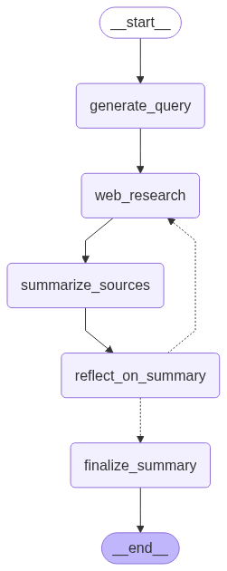

# MCP Deep Researcher Server

> **General:** This repository provides an MCP (Model Context Protocol) server that uses an agent-based system (LangGraph) to perform in-depth research on a given topic.

## Overview

This server integrates with other MCP services like Tavily (for web search) and Arxiv (for academic papers) to conduct comprehensive research and generate a structured report.



## MCP Tools:

1. `deep_research`
    - **Description:** Performs in-depth research on a given topic and generates a structured report.
    - **Input:**
        - `research_topic` (required): The topic to research.
        - `max_web_research_loops` (optional): Maximum number of web research iterations.
    - **Output:** A JSON string containing the research report with sections like summary, key findings, etc.

## Requirements

- Python 3.12+
- UV (for dependency management)
- Docker and Docker Compose
- API keys for integrated services (e.g., Tavily, Arxiv, LLM providers).

## Setup

### 1. Clone the Repository
```bash
# path: /path/to/your/projects/
git clone <repository-url>
```

### 2. Create `.env` File
Create a `.env` file inside `./mcp-server-deepresearcher/`. The URLs you provide depend on whether you are running the other MCP services locally or in Docker.

**For Local Development:**
```dotenv
# LLM Configuration
GOOGLE_API_KEY="your_google_api_key"

# MCP Service URLs for local development
MCP_TAVILY_URL="http://localhost:8005/mcp-server/mcp"
MCP_ARXIV_URL="http://localhost:8006/mcp-server/mcp"
```

**For Docker Compose:**
```dotenv
# LLM Configuration
GOOGLE_API_KEY="your_google_api_key"

# MCP Service URLs for Docker Compose
MCP_TAVILY_URL="http://mcp_server_tavily:8000/mcp-server/mcp"
MCP_ARXIV_URL="http://mcp_server_arxiv:8000/mcp-server/mcp"
```

### 3. Install Dependencies
```bash
# path: ./mcp-servers/mcp-server-deepresearcher/
uv sync
```

## Running the Server

### Using Docker Compose (Recommended)
This server is designed to work with other MCP services.

```bash
# path: ./mcp-servers
# Build and start all services
docker compose up --build -d

# View logs for the deep researcher
docker compose logs -f mcp_server_deepresearcher
```

### Locally
Ensure the other required MCP services (e.g., Tavily, Arxiv) are running locally.

```bash
# path: ./mcp-servers/mcp-server-deepresearcher/
uv run python -m mcp_server_deepresearcher
```

## Testing

```bash
# path: ./mcp-servers/mcp-server-deepresearcher/
# Run all tests
uv run pytest
```

## Project Structure

```
mcp-server-deepresearcher/
├── src/
│   └── mcp_server_deepresearcher/
│       ├── deepresearcher/
│       │   ├── __init__.py
│       │   ├── config.py
│       │   ├── graph.py
│       │   ├── module.py
│       │   ├── prompts.py
│       │   ├── state.py
│       │   └── utils.py
│       ├── __init__.py
│       ├── __main__.py
│       ├── logging_config.py
│       └── server.py
├── .gitignore
├── Dockerfile
├── LICENSE
├── pyproject.toml
├── README.md
└── uv.lock
```

## Contributing

1. Fork the repository
2. Create your feature branch
3. Commit your changes
4. Push to the branch
5. Create a Pull Request

## License

MIT
