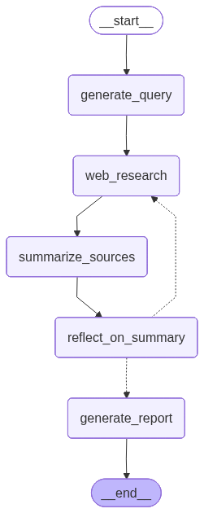

# MCP Deep Researcher Server
> **General:** This repository provides an MCP (Model Context Protocol) server that uses an agent-based system (LangGraph) to perform in-depth research on a given topic. It features a hybrid architecture supporting both REST API and MCP protocol access.

## Capabilities

### 1. **API-Only Endpoints** (`/api`)

Standard REST endpoints for traditional clients (e.g., web apps, dashboards).

| Method | Endpoint                        | Price    | Description                                    |
| :----- | :------------------------------ | :------- | :--------------------------------------------- |
| `GET`  | `/api/health`                   | **Free** | Checks the server's operational status         |
| `GET`  | `/api/reports`                  | **Free** | Retrieve research reports from database        |
| `GET`  | `/api/reports/by-topic/{topic}` | **Free** | Get reports by specific topic                  |
| `GET`  | `/api/reports/{report_id}`      | **Free** | Get a specific report by ID                    |

### 2. **Hybrid Endpoints** (`/hybrid`)

Accessible via both REST and as MCP tools. Ideal for functionality shared between humans and AI.

| Method/Tool        | Price    | Description                                 |
| :----------------- | :------- | :------------------------------------------ |
| `GET /hybrid/pricing` | **Free** | Returns tool pricing configuration          |
| `deep_research`    | **Paid** | Performs in-depth research on a given topic |

*Note: Paid endpoints require x402 payment protocol configuration. See the x402 Payment Support section for details.*

## API Documentation

This server automatically generates OpenAPI documentation. Once the server is running, you can access the interactive API docs at:

- **Swagger UI**: [http://localhost:8003/docs](http://localhost:8003/docs) (for REST endpoints)
- **MCP Inspector**: Use an MCP-compatible client to view available agent tools [http://localhost:8003/mcp](http://localhost:8003/mcp)

These interfaces allow you to explore all REST-accessible endpoints, view their schemas, and test them directly from your browser.

## Requirements

- **Python 3.12+**
- **UV** (for dependency management)
- **Docker and Docker Compose**
- **PostgreSQL** (for caching research reports)
- **API keys** for integrated services (e.g., Google AI, Tavily, Arxiv, LLM providers)
- **MCP servers** (optional - see Integration with Other MCP Servers section)

## Setup

1. **Clone & Configure**
   ```bash
   # path: /path/to/your/projects/
   git clone <repository-url>
   cd mcp-servers/mcp-server-deepresearcher
   cp env.example .env
   # Configure environment for LLM, MCP servers, database, etc. (see .env section below)
   ```

2. **Create `.env` File**

   Create a `.env` file inside `./mcp-server-deepresearcher/` with the following environment variables. **Note:** Most MCP server URLs are optional - the server will work with whatever MCP servers you configure.

   **Complete Environment Variables Reference:**

   ```dotenv
   # ============================================================================
   # LLM Configuration (Required)
   # ============================================================================
   # At least one LLM provider API key is required
   GOOGLE_API_KEY="your_google_api_key"                    # Required: Main LLM provider
   TOGETHER_API_KEY="your_together_api_key"                # Optional: Spare LLM fallback
   MISTRAL_API_KEY="your_mistral_api_key"                  # Optional: Thinking LLM

   # LLM Model Configuration (Optional - uses defaults if not set)
   MODEL_PROVIDER="google"                                  # Default: "google"
   MODEL_NAME="gemini-2.0-flash"                          # Default: "gemini-2.0-flash"
   MODEL_PROVIDER_SPARE="google"                           # Default: "google"
   MODEL_NAME_SPARE="gemini-2.0-flash"                     # Default: "gemini-2.0-flash"
   MODEL_PROVIDER_THINKING="google"                        # Optional: Thinking model provider
   MODEL_NAME_THINKING="gemini-2.5-pro"                    # Optional: Thinking model name

   # ============================================================================
   # MCP Service URLs (Optional - server works with any subset)
   # ============================================================================
   # Configure URLs for MCP servers you want to use
   # The server will work with whatever MCP servers are available

   # For Local Development:
   MCP_TAVILY_URL="http://localhost:8005/mcp-server/mcp"           # Optional: Web search
   MCP_ARXIV_URL="http://localhost:8006/mcp-server/mcp"            # Optional: Academic papers
   MCP_TWITTER_APIFY_URL="http://localhost:8109/mcp-server/mcp"    # Optional: Twitter scraping
   MCP_YOUTUBE_APIFY_URL="http://localhost:8111/mcp-server/mcp"    # Optional: YouTube videos
   MCP_TELEGRAM_PARSER_URL="http://localhost:8112/mcp-server/mcp" # Optional: Telegram channels

   # For Docker Compose (use service names):
   # MCP_TAVILY_URL="http://mcp_server_tavily:8000/mcp-server/mcp"
   # MCP_ARXIV_URL="http://mcp_server_arxiv:8000/mcp-server/mcp"
   # MCP_TWITTER_APIFY_URL="http://mcp_server_twitter_apify:8000/mcp-server/mcp"
   # MCP_YOUTUBE_APIFY_URL="http://mcp_server_youtube_v2:8000/mcp-server/mcp"
   # MCP_TELEGRAM_PARSER_URL="http://mcp_server_telegram_parser:8000/mcp-server/mcp"

   # ============================================================================
   # Apify Configuration (Optional)
   # ============================================================================
   # Required only if using Twitter or YouTube Apify-based MCP servers
   APIFY_TOKEN="your_apify_token"                          # Optional: For Apify actors

   # ============================================================================
   # Database Configuration (Required for caching)
   # ============================================================================
   DB_NAME=mcp_deep_research_postgres                      # Default: "mcp_deep_research_postgres"
   DB_USER=postgres                                        # Default: "postgres"
   DB_PASSWORD=postgres                                    # Default: "postgres"
   DB_HOST=localhost                                       # Default: "localhost"
   DB_PORT=5432                                            # Default: "5432"

   # ============================================================================
   # Langfuse Configuration (Optional - for tracing)
   # ============================================================================
   LANGFUSE_API_KEY="your_langfuse_api_key"               # Optional: Langfuse API key
   LANGFUSE_SECRET_KEY="your_langfuse_secret_key"         # Optional: Langfuse secret key
   LANGFUSE_HOST="https://cloud.langfuse.com"             # Optional: Defaults to cloud
   LANGFUSE_PROJECT="deepresearcher"                      # Optional: Project name

   # ============================================================================
   # x402 Payment Configuration (Optional)
   # ============================================================================
   MCP_DEEP_RESEARCHER_X402_PRICING_MODE=off              # "on" or "off" (default: "on")
   MCP_DEEP_RESEARCHER_X402_PAYEE_WALLET_ADDRESS=""      # Optional: Wallet address for payments

   # CDP Facilitator (for mainnet payments)
   MCP_DEEP_RESEARCHER_X402_CDP_API_KEY_ID=""            # Optional: CDP API key ID
   MCP_DEEP_RESEARCHER_X402_CDP_API_KEY_SECRET=""        # Optional: CDP API key secret

   # Or use custom facilitator URL
   MCP_DEEP_RESEARCHER_X402_FACILITATOR_URL=""            # Optional: Custom facilitator URL

   # ============================================================================
   # Other Configuration (Optional)
   # ============================================================================
   LOGGING_LEVEL=INFO                                      # Optional: Logging level
   ```

   **Minimal Configuration Example:**

   The server can run with just the essentials:

   ```dotenv
   # Minimum required configuration
   GOOGLE_API_KEY="your_google_api_key"
   MCP_TAVILY_URL="http://localhost:8005/mcp-server/mcp"
   DB_NAME=mcp_deep_research_postgres
   DB_USER=postgres
   DB_PASSWORD=postgres
   DB_HOST=localhost
   DB_PORT=5432
   ```

   **Note:** The server will start and function with any combination of MCP servers. If some MCP servers are unavailable, the server will log warnings but continue operating with the available tools.

3. **Virtual Environment**
   ```bash
   # path: ./mcp-servers/mcp-server-deepresearcher/
   uv sync
   ```

## Running the Server

### Prerequisites

Before starting the server, ensure:
1. PostgreSQL is running (for caching)
2. At least one MCP server is configured (the server works with any subset)
3. Environment variables are configured in `.env` (at minimum: `GOOGLE_API_KEY` and database settings)

**Note:** The server doesn't require all MCP servers to be available. It will work with whatever MCP servers you configure and can connect to.

### Using Docker Compose (Recommended)

This server is designed to work with other MCP services in the repository.

```bash
# path: ./mcp-servers
# Build and start all services
docker compose -f docker-compose-dev.yml up --build -d

# View logs for the deep researcher
docker compose -f docker-compose-dev.yml logs -f mcp_server_deepresearcher

# Check service status
docker compose -f docker-compose-dev.yml ps
```

### Locally

Ensure the other required MCP services and PostgreSQL are running locally.

```bash
# path: ./mcp-servers/mcp-server-deepresearcher/
# Start the server with hot reload (development)
./scripts/start-server.sh

# Or run directly
uv run python -m mcp_server_deepresearcher

# Production mode (no hot reload)
./scripts/start-server.sh --no-reload
```

### Using Docker (Standalone)

```bash
# path: ./mcp-servers/mcp-server-deepresearcher/
# Build the image
docker build -t mcp-server-deepresearcher .

# Run the container
docker run --rm -it -p 8003:8000 --env-file .env mcp-server-deepresearcher
```

### Starting PostgreSQL Database

The server requires PostgreSQL for caching. Use the provided script:

```bash
# path: ./mcp-server-deepresearcher/
./scripts/start-db.sh
```

Or manually:
```bash
docker run -d \
  --name mcp-deep-research-postgres-local \
  -e POSTGRES_PASSWORD=postgres \
  -e POSTGRES_DB=mcp_deep_research_postgres \
  -p 5432:5432 \
  postgres:15
```

### Server Endpoints

Once running, the server exposes:

- **REST API**: `http://localhost:8003`
- **API Docs**: `http://localhost:8003/docs` (Swagger UI with interactive testing)
- **MCP Endpoint**: `http://localhost:8003/mcp`
- **Health Check**: `http://localhost:8003/api/health`
- **Reports API**: `http://localhost:8003/api/reports` (query stored research reports)

## Testing

The project includes comprehensive test suites covering unit tests, integration tests, and end-to-end tests.

### Running Tests

```bash
# path: ./mcp-server-deepresearcher/
# Run all tests
uv run pytest

# Run with coverage
uv run pytest --cov=src/mcp_server_deepresearcher --cov-report=html

# Run only unit tests (exclude E2E)
uv run pytest --ignore=tests/e2e -m "not integration"

# Run specific test file
uv run pytest tests/test_server.py

# Run tests matching a pattern
uv run pytest -k "test_deep_research"
```

### Test Structure

- **Unit Tests**: Fast, isolated tests for individual components
  - `tests/test_server.py` - MCP server tests
  - `tests/test_app.py` - FastAPI app tests
  - `tests/test_hybrid_routes.py` - Hybrid route tests
  - `tests/test_api_routes.py` - REST API route tests
  - `tests/test_database.py` - Database operation tests
  - `tests/middlewares/test_x402_wrapper.py` - Payment middleware tests

- **Integration Tests**: Tests that require external services
  - Marked with `@pytest.mark.integration`
  - May require running MCP servers

- **E2E Tests**: End-to-end tests requiring full server
  - Located in `tests/e2e/`
  - Marked with `@pytest.mark.slow`
  - Require running server instance

### Excluding E2E Tests

E2E tests are slower and require a running server. Exclude them with:

```bash
# Option 1: Exclude by directory
pytest tests/ --ignore=tests/e2e

# Option 2: Exclude by marker
pytest tests/ -m "not integration"

# Option 3: Exclude both slow and integration
pytest tests/ -m "not slow and not integration"
```

### Test Configuration

See `tests/README_TESTING.md` for detailed testing documentation.

## Project Structure

```
mcp-server-deepresearcher/
├── src/
│   └── mcp_server_deepresearcher/
│       ├── __init__.py
│       ├── __main__.py              # Entry point (CLI + uvicorn)
│       ├── app.py                   # Application factory & lifespan
│       ├── dependencies.py          # FastAPI dependency injection
│       ├── logging_config.py        # Logging configuration
│       ├── schemas.py               # Pydantic request/response models
│       ├── x402_config.py           # x402 payment configuration
│       │
│       ├── api_routers/             # API-Only endpoints (REST)
│       │   ├── __init__.py
│       │   ├── health.py            # Health check endpoint
│       │   └── reports.py           # Report retrieval endpoints
│       │
│       ├── hybrid_routers/          # Hybrid endpoints (REST + MCP)
│       │   ├── __init__.py
│       │   ├── deep_research.py     # Main research endpoint
│       │   └── pricing.py           # Pricing information
│       │
│       ├── middlewares/             # x402 payment middleware
│       │   ├── __init__.py
│       │   └── x402_wrapper.py      # Payment validation
│       │
│       ├── db/                      # PostgreSQL database layer
│       │   ├── __init__.py
│       │   ├── database.py          # Connection and operations
│       │   └── models.py            # SQLAlchemy models
│       │
│       └── deepresearcher/          # Core research agent (business logic)
│           ├── __init__.py
│           ├── config.py            # Configuration classes
│           ├── graph.py             # LangGraph definition
│           ├── mcp_init.py          # MCP server initialization
│           ├── prompts.py           # LLM prompts
│           ├── state.py             # Graph state definition
│           └── utils.py             # Utility functions
│
├── scripts/                         # Helper scripts
│   ├── start-db.sh                  # Start PostgreSQL
│   └── start-server.sh              # Start server
├── tests/                           # Test suite
│   ├── e2e/                         # End-to-end tests
│   ├── middlewares/                 # Middleware tests
│   ├── conftest.py                  # Pytest fixtures
│   ├── README_TESTING.md            # Testing documentation
│   └── test_*.py                    # Test files
├── .gitignore
├── Dockerfile
├── LICENSE
├── pyproject.toml
├── README.md
├── tool_pricing.yaml                # x402 pricing configuration
└── uv.lock
```

## Integration with Other MCP Servers

This server **requires** integration with other MCP servers in the repository to function properly. It acts as an orchestrator that combines tools from multiple specialized MCP servers:

### Commonly Used MCP Servers

The server can connect to the following MCP servers (all optional - configure only what you need):

1. **Tavily** (`mcp-server-tavily`) - Web search capabilities
   - Provides `tavily_web_search` tool
   - Useful for web research functionality

2. **Arxiv** (`mcp-server-arxiv`) - Academic paper search
   - Provides `arxiv_search` tool
   - Useful for academic research

### Optional MCP Servers

3. **Twitter/Apify** (`mcp-server-twitter-apify`) - Twitter content scraping
   - Provides `apidojo-slash-tweet-scraper` and `apidojo-slash-twitter-scraper-lite` tools
   - Enables Twitter-based research

4. **YouTube** (`mcp-server-youtube-v2`) - YouTube video search and transcripts
   - Provides `youtube_search_and_transcript`, `search_and_extract_transcripts`, `mcp_search_youtube_videos` tools
   - Enables video content research

5. **Telegram Parser** (`mcp-server-telegram-parser`) - Telegram channel parsing
   - Provides `parse_telegram_channels` tool
   - Enables Telegram-based research

### Server Connection Behavior

**Important:** The server can function with any subset of MCP servers. It doesn't require all servers to be available.

- The server attempts to connect to all configured MCP servers at startup
- **If a server fails to connect, the server continues with available tools** - missing MCP servers don't prevent the server from starting
- Each server connection has a 30-second timeout
- Tools are collected from successfully connected servers only
- The research agent uses whatever tools are available - more tools provide more comprehensive research, but the server works with just one
- If no MCP servers are available, research requests will fail with a clear error message

## Key Features

### Hybrid Architecture
Supports both REST API and MCP protocol endpoints, making it accessible to traditional web clients and AI agents.

### Multi-Server Integration
Connects to multiple MCP servers for comprehensive research capabilities.

### x402 Payment Support
Built-in payment middleware for monetizing research endpoints. The server includes built-in x402 payment middleware for monetizing research endpoints.

#### Configuration

Payment options are configured in `tool_pricing.yaml`:

```yaml
deep_research:
  - token_amount: 5000    # ~0.005 USDC
    chain_id: 8453        # Base
    token_address: "0x833589fCD6eDb6E08f4c7C32D4f71b54bdA02913"
  - token_amount: 1000
    chain_id: 84532       # Base Sepolia (Testnet)
    token_address: "0x036CbD53842c5426634e7929541eC2318f3dCF7e"
```

#### Environment Variables

```dotenv
# x402 Configuration
MCP_DEEP_RESEARCHER_X402_PRICING_MODE=on  # or "off" to disable
MCP_DEEP_RESEARCHER_X402_PAYEE_WALLET_ADDRESS=your_wallet_address

# CDP Facilitator (for mainnet)
MCP_DEEP_RESEARCHER_X402_CDP_API_KEY_ID=your_cdp_key_id
MCP_DEEP_RESEARCHER_X402_CDP_API_KEY_SECRET=your_cdp_key_secret

# Or use custom facilitator URL
MCP_DEEP_RESEARCHER_X402_FACILITATOR_URL=https://your-facilitator-url.com
```

#### Payment Flow

1. Client includes `X-PAYMENT` header with payment proof
2. Middleware validates payment against facilitator
3. Request proceeds if payment is valid
4. Returns `402 Payment Required` if payment is missing or invalid

#### Features

- **Method-Aware Pricing**: Automatically detects MCP tool calls and applies correct pricing
- **Multiple Payment Options**: Supports different tokens and networks per endpoint
- **Automatic Validation**: Validates pricing configuration against available routes at startup

### Advanced Caching with PostgreSQL

The server uses PostgreSQL for persistent storage of research reports.

#### Database Schema

Research reports are stored with the following structure:
- `id`: Primary key
- `research_topic`: Indexed topic field for fast lookups
- `title`: Report title
- `executive_summary`: Summary text
- `key_findings`: JSON array of findings
- `sources`: Formatted sources string
- `report_data`: Full report JSON for flexibility
- `research_loop_count`: Number of research iterations performed
- `created_at`, `updated_at`: Timestamps

#### Features

- **Automatic Storage**: All research reports are automatically saved to the database
- **Connection Pooling**: Uses SQLAlchemy connection pooling (pool_size=5, max_overflow=10)
- **Retry Logic**: Exponential backoff retry for database connections (up to 30 attempts)
- **Graceful Degradation**: Research continues even if database save fails
- **Indexed Queries**: Fast topic-based lookups via indexed `research_topic` field

#### Retrieving Reports via REST API

The server provides REST endpoints to query stored research reports:

**Get Recent Reports:**
```bash
# Get 10 most recent reports
GET /api/reports

# Get 20 most recent reports
GET /api/reports?limit=20

# Get recent reports filtered by topic
GET /api/reports?topic=artificial%20intelligence&limit=5
```

**Get Reports by Topic:**
```bash
# Get up to 10 reports for a specific topic
GET /api/reports/by-topic/artificial%20intelligence

# Get up to 5 reports for a specific topic
GET /api/reports/by-topic/artificial%20intelligence?limit=5
```

**Get Specific Report:**
```bash
# Get a report by its ID
GET /api/reports/123
```

All endpoints return JSON responses with report data including title, summary, key findings, sources, and timestamps.

### Langfuse Integration for Tracing

The server integrates with Langfuse for comprehensive tracing of LangGraph execution.

#### Configuration

```dotenv
LANGFUSE_API_KEY=your_api_key
LANGFUSE_SECRET_KEY=your_secret_key
LANGFUSE_HOST=https://cloud.langfuse.com  # Optional, defaults to cloud
LANGFUSE_PROJECT=deepresearcher  # Optional project name
```

#### Features

- **Automatic Tracing**: Each graph execution creates a new trace
- **Unique Session IDs**: Each request gets a unique session ID for tracking
- **Callback Handler**: Uses Langfuse CallbackHandler for LangChain integration
- **Trace Flushing**: Automatically flushes traces after execution
- **Graceful Fallback**: Continues execution if Langfuse is not configured

#### Trace Information

Each trace includes:
- Graph execution steps
- Tool calls and results
- LLM interactions
- State transitions
- Execution metadata

### Parallel Execution & Multitool Use

The research agent executes multiple MCP tools in parallel for efficient research.

#### Implementation

- Uses `asyncio.gather()` for concurrent tool execution
- All available tools are executed simultaneously
- Results are aggregated and processed together
- Failed tools don't block successful ones (`return_exceptions=True`)

#### Supported Tools

The agent can execute these tools in parallel:
- `tavily_web_search` - Web search
- `arxiv_search` - Academic papers
- `youtube_search_and_transcript` - YouTube videos
- `twitter_search_topic` - Twitter content
- `parse_telegram_channels` - Telegram channels
- And more based on available MCP servers

#### Benefits

- **Faster Research**: Parallel execution reduces total research time
- **Comprehensive Coverage**: Multiple sources queried simultaneously
- **Resilience**: Individual tool failures don't stop the entire research process
- **Efficient Resource Usage**: Better utilization of network and API resources

## Research Agent Architecture



The research agent uses LangGraph to orchestrate a multi-step research process with configurable loops and tool execution.

## Contributing

1. Fork the repository
2. Create your feature branch
3. Commit your changes
4. Push to the branch
5. Create a Pull Request

## License

MIT
